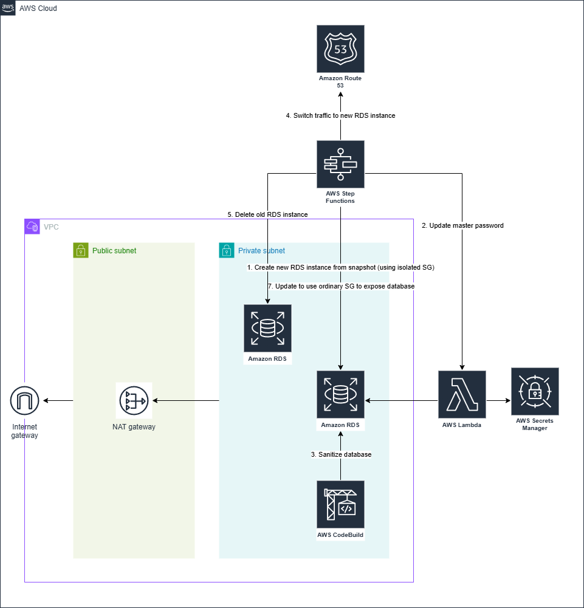
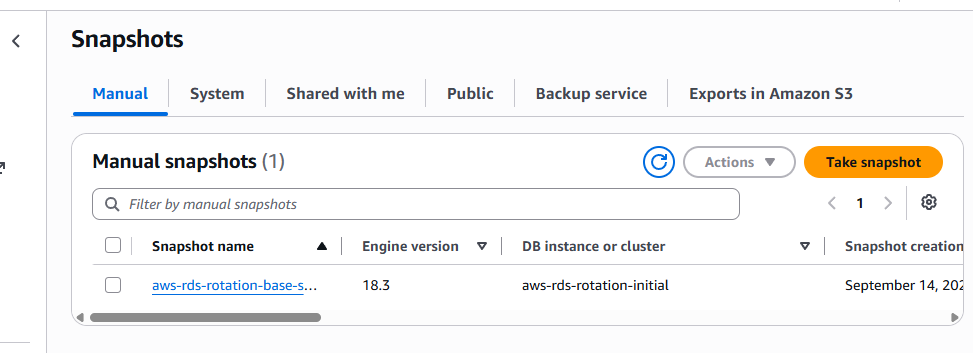
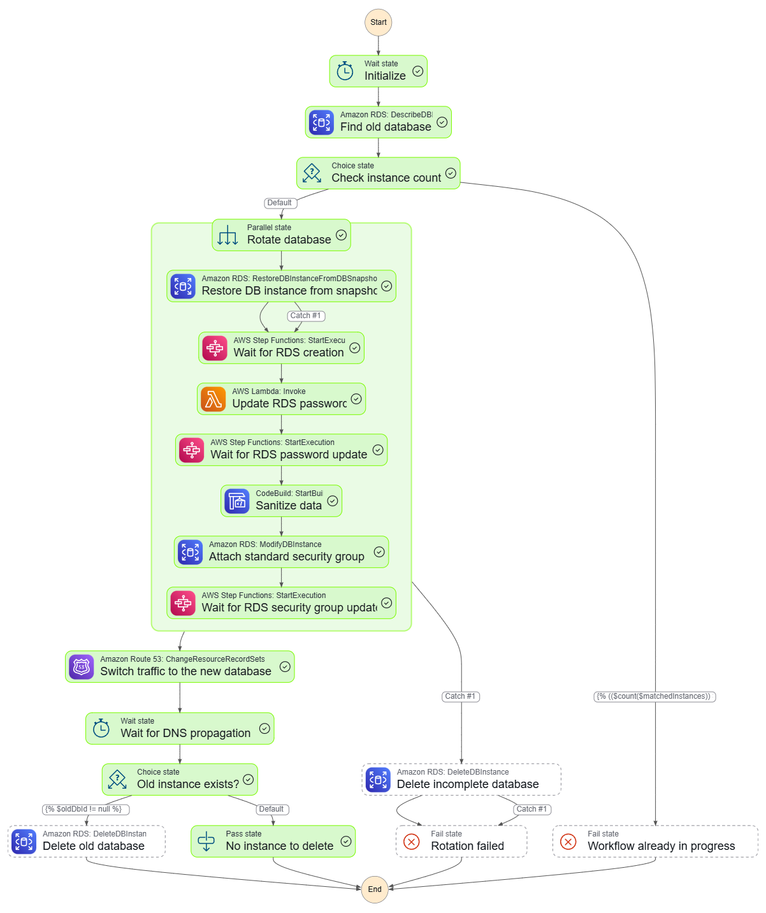

# aws-rds-rotation

[](https://opensource.org/licenses/MIT)

A demo project for automating RDS database recreation from a snapshot.

## 👀 Overview

RDS rotation is a process of replacing a database with a new one from a snapshot. The primary usage is to create a new development database from a production database snapshot with sensitive data masked and scrubbed. Main benefits of this approach include:

- **Improved security**: Sensitive data is protected by masking and scrubbing it in the development database.
- **Easier testing and development**: Developers can work with realistic data without risking exposure of production data.
- **Streamlined database management**: Automates the process of refreshing development databases from production snapshots.
- **Safety**: If any error occurs during the rotation process, incomplete database instance will be deleted automatically, to prevent any sensitive data from being served to development environments.

### 📂 Key directory structure

- `infrastructure/sandbox/`: Contains the Terraform project for deploying and interacting with the sandbox environment.
  - `functions/`: Lambda functions used in the rotation workflow.
  - `sql/`: SQL scripts executed in the CodeBuild pipeline to sanitize the database.
  - `statemachine/`: Contains the Step Functions state machine definitions for the rotation workflow.
- `infrastructure/setup/`: Contains the Terraform project for creating the RDS snapshot.
  - `scripts/`: Contains scripts used in the setup project, such as waiting for the bastion EC2 instance to be ready and seeding the database.
- `scripts/`: Contains general-purpose scripts used in the project, such as connecting to the database via Session Manager.

## 🏗️ Architecture



## ⚙️ Technical details

The main workflow consists of various AWS services such as Step Functions, Lambda, CodeBuild, and RDS, which work together to automate the database rotation process.

- Step Functions

    Core of the database rotation workflow, orchestrating the sequence of steps and handling error scenarios.

- Lambda

    Executes custom logic within the rotation workflow, such as updating database credentials and connection settings.

    - RDS password updater: Updates the database credentials securely during the rotation process, without exposing the secret content (database password) to the SFN execution context and logs.

- CodeBuild

    Performs tasks such as sanitizing the database by running SQL scripts to mask and scrub sensitive data.

    Initially, a Lambda function was supposed to handle the database sanitization, but it was later moved to CodeBuild for better scalability and maintainability, as CodeBuild can handle longer-running tasks (Lambda has 15 minutes timeout) and provides more control over the execution environment.

- Route 53

    Manages DNS records to switch traffic to the new RDS database during the rotation process. Database consumers no need to be aware of the underlying database changes, ensuring a seamless transition.

    Note, there might be a brief period of DNS propagation delay (about 1 minute) when switching traffic to the new RDS database. During this time, some clients may still connect to the old database until the DNS changes fully propagate, which might result in temporary inconsistencies or connection issues.

- Other (VPC, CloudWatch, S3, IAM, etc.)

    Foundational services that support the overall rotation workflow, such as IAM permissions, networking, execution logs, and so on.

In addition, for security reasons, the RDS instance is restored with an isolation security group. The isolation SG is only accessible from the CodeBuild environment, preventing exposure of sensitive data in the middle of the rotation process.

## 💻 Getting started

This project contains two main Terraform projects: **setup** and **sandbox**. The former project is responsible for creating an RDS snapshot, while the latter project is for deploying and interacting with the sandbox environment to develop and test the RDS rotation workflow.

> [!NOTE]
> **setup** and **sandbox** stacks are separated intentionally for better modularity and to clearly distinguish between the initial RDS snapshot creation and the sandbox environment used for development and testing. With this separation, we can focus on each stage independently and manage resources more effectively.

### 🛠️ Prerequisites

This repository uses [Nix Flakes](https://nix.dev/concepts/flakes.html) to manage tools. The following tools will be automatically installed (you must have `nix` installed):

- `pre-commit`
- `terraform`
- `awscli2` (`aws`)
- `ssm-session-manager-plugin` (`session-manager-plugin`)
- `postgresql_18` (`psql`)
- `uv`

Run `nix develop` to activate the environment. This will automatically install the above tools. Alternatively, you can use the included [Dev Container configuration](./.devcontainer.example/devcontainer.json) which has Nix installed.

Also note that this project requires appropriate IAM permissions, which means it requires administrative privileges for managing AWS resources such as IAM, VPC, Step Functions, EC2, RDS, Route 53, Lambda, CodeBuild, and so on.

### 📝 Create initial RDS snapshot

> [!NOTE]
> You can use your existing snapshot (if you have one) for the setup, but it might not be 100% compatible with the sandbox environment.

```bash
$ cd infrastructure/setup
$ terraform init

# Create initial database, seeding with Pagila dataset
$ terraform apply

# Get the base snapshot identifier
$ terraform output -raw base_snapshot_id

# Destroy the initial database to cleanup resources and create final RDS snapshot
$ terraform destroy
```

You should see the final snapshot created in the AWS Management Console like below:



### 🚀 Provision sandbox environment

Next, provision the sandbox environment by navigating to the `infrastructure/sandbox` directory and applying the Terraform configuration.

```bash
$ cd infrastructure/sandbox
$ terraform init
$ terraform apply
```

Now we can start a new Step Functions execution to trigger the RDS rotation workflow. Set `snapshotId` in the example input to the value returned by `terraform output -raw base_snapshot_id` in the previous step. Refer to the example input: [./infrastructure/sandbox/statemachine/input.json.example](./infrastructure/sandbox/statemachine/input.json.example)


Once the workflow is completed, you should see the final state of the workflow as depicted in the diagram below.



To verify the database, you can connect to the RDS instance using the `psql` command-line tool. But RDS instance is only accessible within the VPC, so you need to use a bastion host or an SSH tunnel to connect to it.

For this, example command is exposed as Terraform output. You can run it directly after provisioning the sandbox environment:

```bash
$ sh -c "$(terraform output -raw psql_command)"
```

## 🧹 Cleanup

Because RDS instances are created and managed by Step Functions, `terraform destroy` will not automatically delete them. You will encounter error messages indicating that the RDS instances cannot be deleted, for example:

```plaintext
│ Error: deleting RDS Subnet Group (aws-rds-rotation-db-subnet-group-27111fb6aa1f6256c63472ce35): operation error RDS: DeleteDBSubnetGroup, https response error StatusCode: 400, RequestID: 5b3d6f5a-ec8d-4a9c-9320-b5aeb9176446, InvalidDBSubnetGroupStateFault: Cannot delete the subnet group 'aws-rds-rotation-db-subnet-group-27111fb6aa1f6256c63472ce35' because at least one database instance: aws-rds-rotation-db-20260908t190752 is still using it.
```

To clean up the environment properly, you need to manually clean up the RDS instances before destroying the sandbox environment. In addition, if you have created RDS snapshot in setup step, you should also delete those snapshots to avoid incurring unnecessary costs (it's tiny but can add up over time).

## 📜 License

This project is licensed under the MIT License.
