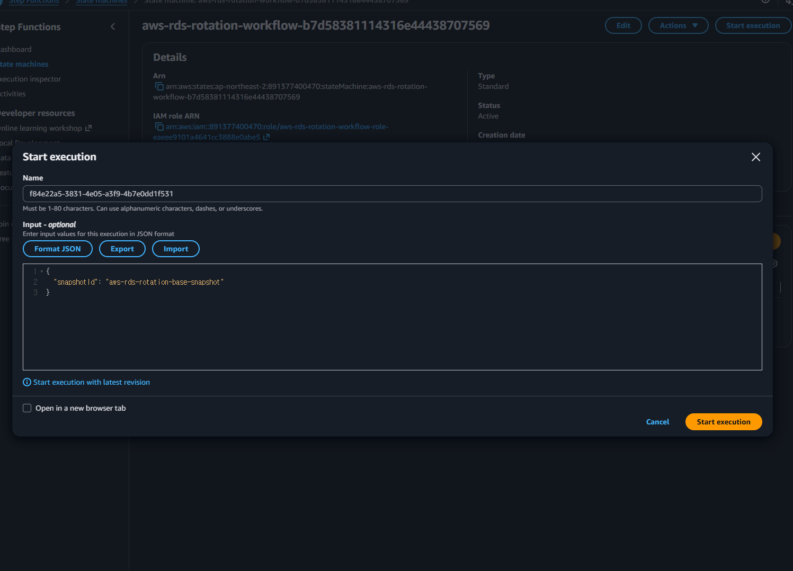
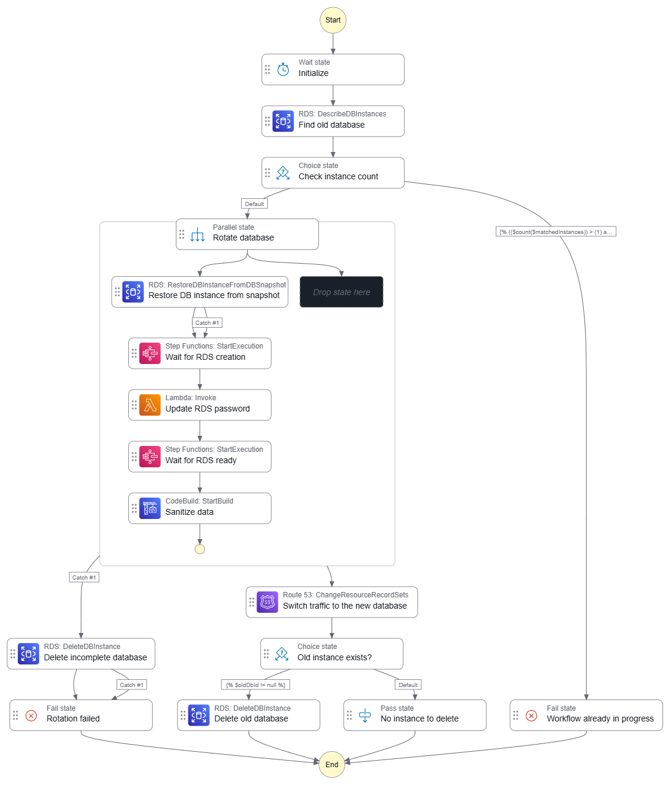
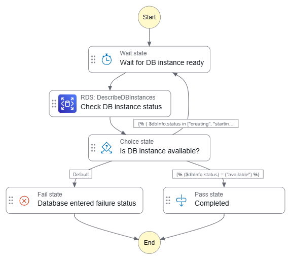

# Sandbox

This directory contains the Terraform configuration files for deploying the AWS RDS Rotation sandbox.

## How to use this sandbox

1. `terraform apply` to deploy the sandbox environment.

2. Interact with the resources as needed, for example, start a new SFN execution.

    

3. `terraform destroy` to clean up the resources. Remember to manually delete any resources not tracked by Terraform as mentioned above.

Test commands are exposed as output for convenience. For example, you can run `sh -c "$(tf output -raw psql_command)"` to connect to the test database.

## Technical details

Main workflow consists of various AWS services including Step Functions, Lambda, CodeBuild, and so on. Below is a breakdown of the key components and their roles within the sandbox environment.

### Step Functions

Core of the sandbox environment is the main Step Functions workflow that orchestrates the AWS RDS Rotation process.

- Main workflow

    Handles the main workflow for AWS RDS Rotation, coordinating various services and ensuring the proper sequence of operations.

    

- "Wait for RDS ready" sub-workflow

    Waiter sub-workflow that pauses execution until the RDS instance is ready, ensuring that subsequent operations are performed only when the database is fully available.

    

    This workflow can be inlined within the main workflow if desired. However, for maintainability and clarity, we decided to keep it as a separate sub-workflow.

### Lambda

Lambda functions are used to perform various tasks that cannot be easily handled by other services, such as custom logic, data processing, and integration with external systems.

- "RDS password updater" Lambda function

    Responsible for updating the RDS instance password as part of the rotation process. This function is used to update RDS master password securely, without the secret being exposed to the SFN execution context and logs.

### CodeBuild

CodeBuild is responsible for masking and scrubbing sensitive data from the database. It can run arbitrary SQL commands as needed.

> [!NOTE]
> Initially, a Lambda function was used for this purpose, but it was later replaced by the CodeBuild project to provide better control and flexibility over the database operations, overcoming the limitations of the Lambda-based approach such as execution time limits.

### Route 53

Route 53 is used for managing traffic routing to the database. This allows for easy access to the resources within the sandbox using friendly domain names instead of IP addresses.

### Other resources

VPC, subnets, security groups, and other components are not directly related to the core functionality, but are required for the sandbox environment as foundational infrastructure to support the deployment and operation of the RDS instances and associated services.

## Cleanup

Some resources aren't tracked by Terraform and need to be deleted manually to avoid unnecessary costs and resource clutter:

- **RDS instances** created by SFN workflow

  When destroying the stack, you need to delete these instances manually first. Otherwise, you will be blocked because of its dependencies such as RDS subnet group:

  ```plaintext
  │ Error: deleting RDS Subnet Group (aws-rds-rotation-db-subnet-group-27111fb6aa1f6256c63472ce35): operation error RDS: DeleteDBSubnetGroup, https response error StatusCode: 400, RequestID: 5b3d6f5a-ec8d-4a9c-9320-b5aeb9176446, InvalidDBSubnetGroupStateFault: Cannot delete the subnet group 'aws-rds-rotation-db-subnet-group-27111fb6aa1f6256c63472ce35' because at least one database instance: aws-rds-rotation-db-20260908t190752 is still using it.
  ```

- **The final database snapshot** if you created one during the sandbox setup (if you no longer need it).
