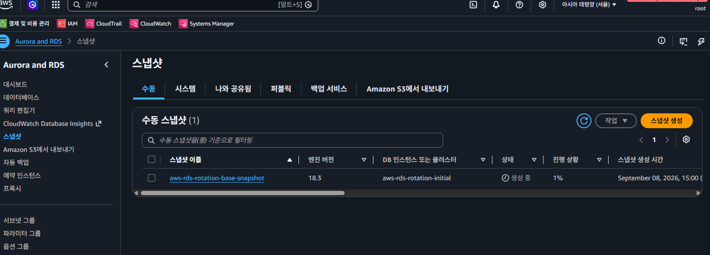

# Setup

> [!NOTE]
> If you have our own existing database snapshot, you can use it instead of creating a new one. You can skip this setup entirely.

This directory contains the Terraform configuration files for creating initial database snapshot for demo (sandbox).

## How to use this setup

This setup creates the RDS database with initial data for use in the main demo environment. Final RDS snapshot will be created on destroy if `var.create_db_snapshot` is set to `true` (enabled by default).

1. `terraform apply` to create initial database

    RDS provisioned and database initialization is performed via `psql` over [Session Manager](https://docs.aws.amazon.com/systems-manager/latest/userguide/session-manager.html). We use [Pagila](https://github.com/devrimgunduz/pagila) sample dataset.

1. `terraform output` to view the outputs, including the final snapshot identifier.

    Save the final snapshot identifier (`base_snapshot_id`) for future reference. We will need it when setting up the main demo environment.

1. `terraform destroy` to clean up the resources and create the final snapshot.

    

    On destroy, final database snapshot will be created and can be used for future reference.

## Why separate this setup

Even though the main demo environment could technically handle the initial database snapshot creation, separating out this setup is beneficial because:

- It is a cleaner and more modular approach.
- It separates concerns about the initial database snapshot creation from the main demo environment.
- It allows us to focus on the main demo, the rotation workflow logic.
